# 某宝白菜价白牌总线舵机研究记

在某宝上淘换了两个白牌的单总线舵机(拆机件，店主介绍说是某必选机器人上面的关节舵机)，巨便宜，11块5。如果你到某宝上查看下配套齐全的总线舵机是什么价，就知道这个白牌舵机是不是白菜价了。

但白菜价有白菜价的道理，这款舵机没资料，没协议。于是拆解并研究之，最终目标是搞明白通信协议，使用arduino驱动它。

如果你看到白菜价心跳加速了，先稳住，别冲动马上去买，先把我这篇帖子看完，最起码把最后一节关于某宝上能买到的4款UBT舵机的比较测试看完了，然后再决定买哪一款。

这篇文档是关于此舵机的全部研究记录，循序渐进。

打个小广告： 
如果各位看官觉得这个项目对你很有帮助，方便的话请光临下小店，在下文链接的宝贝上拍一单，一块钱，小店一分不赚，全部捐赠（PC版TB网页为证），谢谢支持！
宝贝链接：    
https://item.taobao.com/item.htm?spm=a230r.7195193.1997079397.9.75b524d6Pn7IlS&id=593044206467&abbucket=20    

 **温馨提示： B站有位朋友发现了一个问题，以游客身份浏览此页面的话，有些图片看不到。我也是由此才发现码云有这么个抽风龟腚：大于1M的文件，不登录gitee账户的话是看不到的，我对此也表示很无奈。**

#### 声明：本项目只是因为个人兴趣而建立的，所有内容仅供研究实验所用，hack他人代码直接用于商业目的是一种不道德的行为，由此导致的商业纠纷一概和本人无关，请支持技术原创。

### 正文  
#### 1. 外观
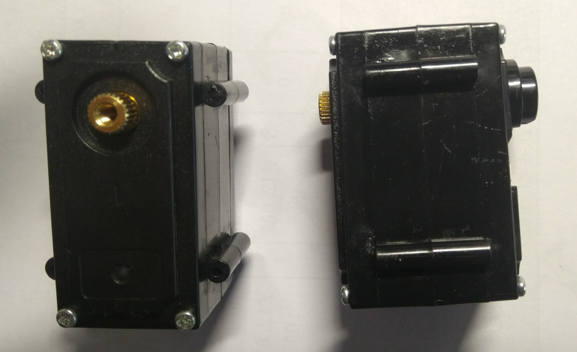
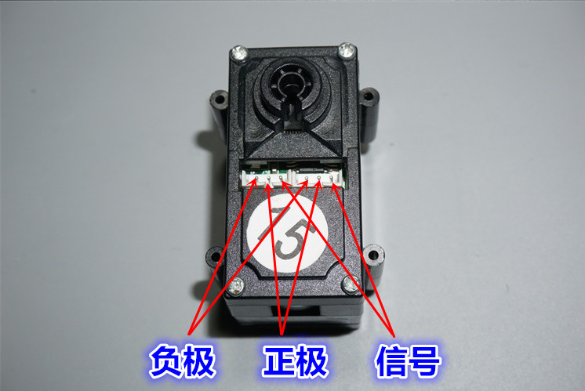
#### 2. 拆解
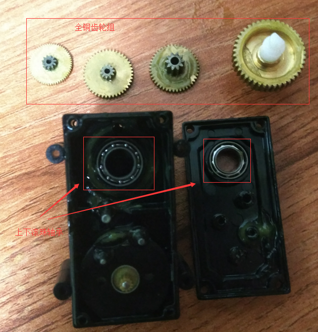
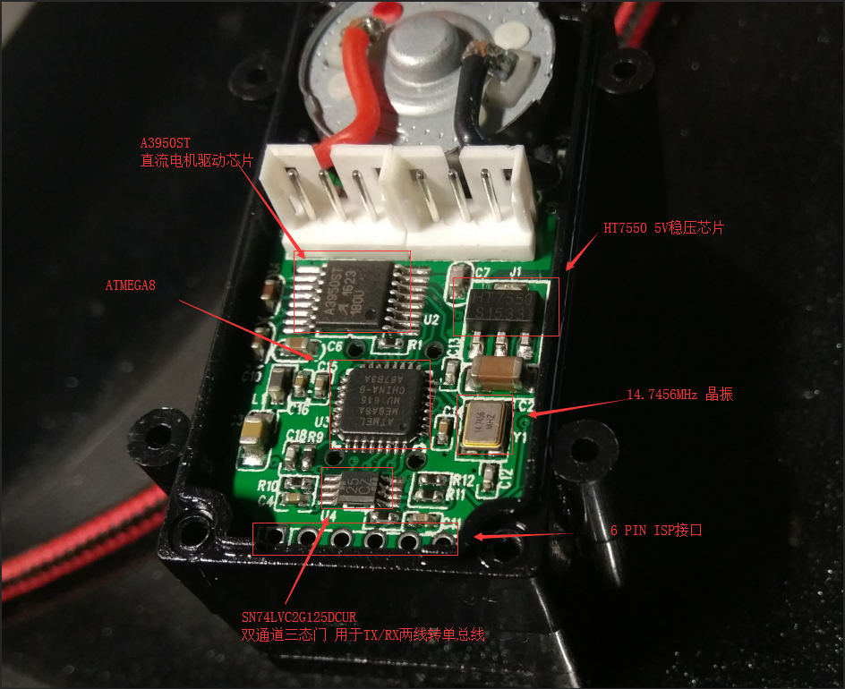
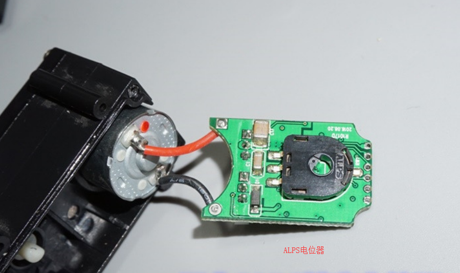
#### 3. 驱动板电路细节测量分析
测量电路主要是为了后面分析程序，所以只关注关键细节即可，具体到边边角角的电阻电容则不去关心，下面是驱动板基本的电路图
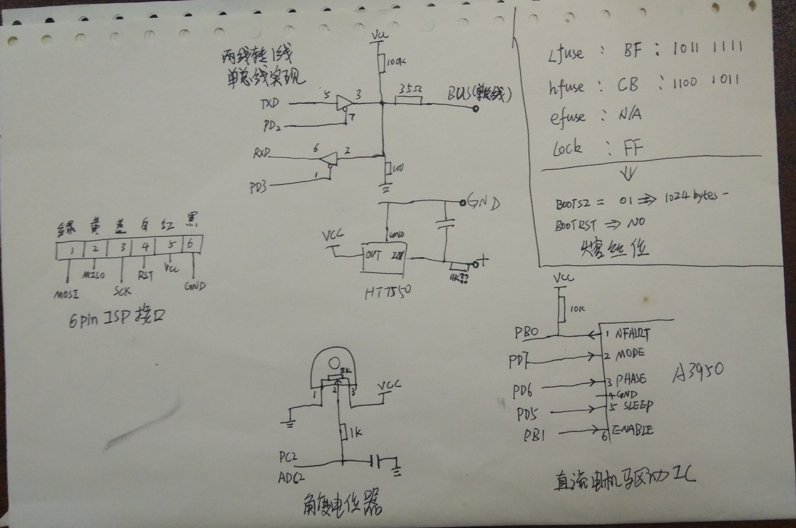
#### 4. 使用avrdude读取主控芯片
从上文的拆解图中有关驱动板正面的部分，可以看到有一个6PIN的排针焊孔，当时猜测可能是ISP烧写程序的接口，使用万用表测了一下，果然是！     
从电路上说，可以烧写程序，则当然可以读出程序，但是必须要有一个前提： 舵机的固件作者没有修改熔丝位锁死ISP功能      
于是乎，抱着试试看的态度，祭出了我的神器usbasp，有了下面的连接图：    
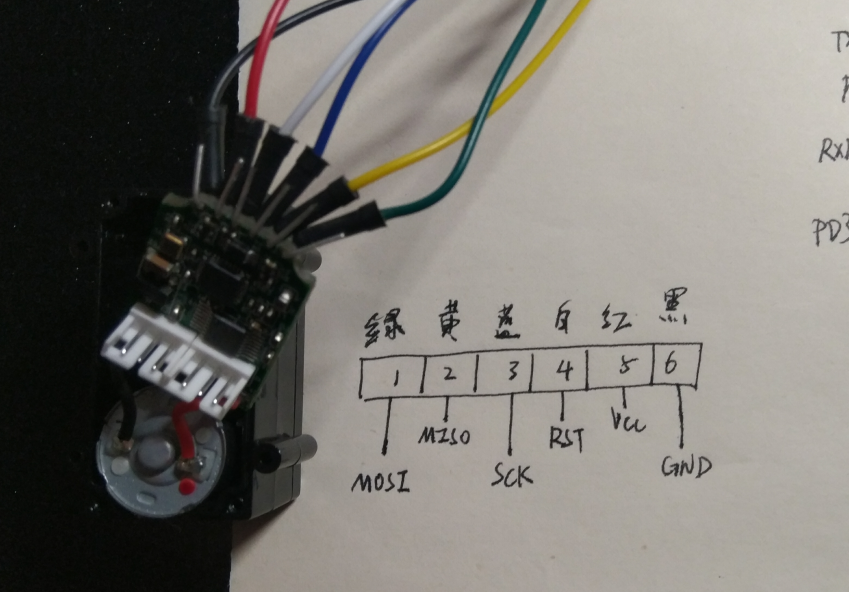
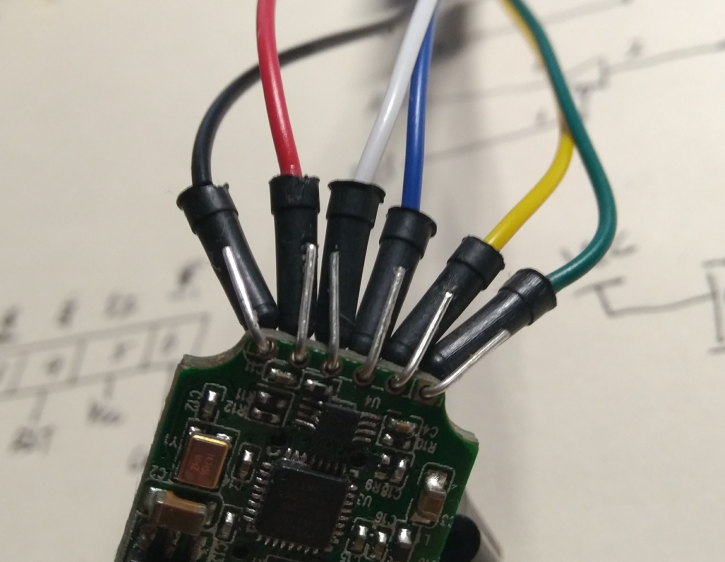

然后使用下面的这条命令尝试读取mega8的flash:    
avrdude -cusbasp -pm8 -U flash:r:mega8_servo.hex:i      
事实证明，固件的作者很厚道，极其厚道！！      
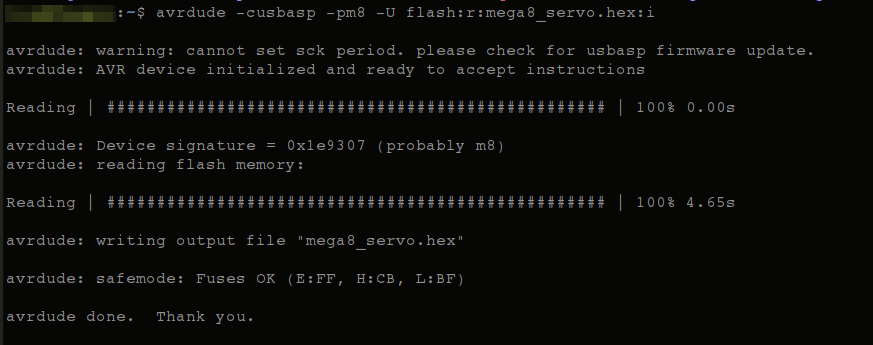    

读出的HEX文件我已经放到项目中了，文件名: mega8_servo.hex    
#### 5. 反汇编
好了，现在hex文件拿到了，下一步就是反汇编之，得到汇编代码，命令如下：     

avr-objdump -D -m avr mega8_servo.hex > mega8_servo.s    
      
这份汇编代码文件我也放到项目中了，顺便提一句，你现在在项目中看到的mega8_servo.s不是反汇编得到的初始文件，    
我加了很多注释。      
#### 6. 汇编代码概览    
有个小插曲：    
当时刚开始分析代码的时候，无意中在电子发某某网站上搞到了一份某必选舵机协议（协议PDF也在本项目中，自取，doc目录 UBTECH_servo_manual.pdf），刚拿到的时候心里一阵窃喜，以为用不着分析代码了，但仔细看了一下，顿时兴致大减，截图为证：
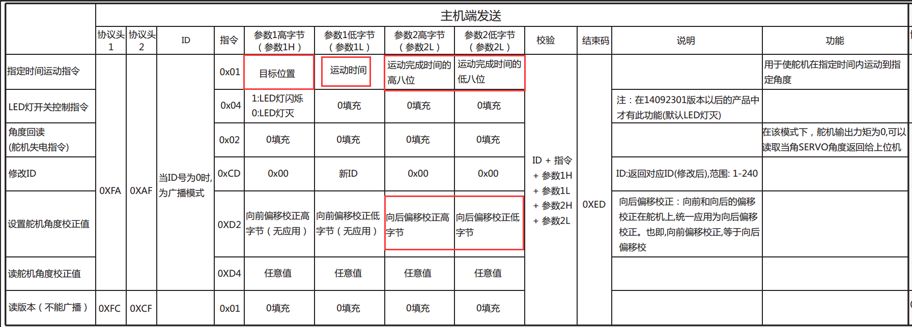    

这份协议说明最大的问题在于，仅仅说明了协议帧格式，而对于各种参数的细节含糊不清，注意红框标出的地方。    
以0x01命令为例：   
- 目标位置     : 数值单位是什么？ 取值范围是多少？ 支不支持负数？    
- 运动时间     : 这个时间是什么含义？ 单位？ 取值范围？ （这个参数是我最后才彻底搞明白的，其他参数程序分析到一半的时候就清楚了）    
- 运动完成时间 : 和上面的问题一样， 具体含义/单位量纲/取值范围 无一不是含糊不清     

所以，想彻底搞懂协议，最终还是要去分析汇编，这份协议列出的帧格式相当于关键线索，可以给分析代码中的协议细节带来很大的帮助。    

断断续续花了二十天的业余时间，整份反汇编代码除了bootloader的部分没看，其它几乎都分析完了，收获超过预期：    
- 协议的所有细节；    
- 程序的整体结构；    
- 发现了隐藏的彩蛋；    
- 发现了几处BUG(无伤大雅)。    

老实说，这份程序写的很糙，甚至可以说非常糙：    
- 代码不精练，大量重复代码；    
- 流程控制没有状态机，全局变量满天飞；    
- 相当多没有意义的全局变量定义和操作；    
- 几乎所有关键函数都是无形参，函数间全部是通过修改全局变量完成数据交换；    
- 定时功能有BUG，定时不准。    

粗列一下此固件的内部情况（如果想亲自分析下反汇编，这些信息很有用）：
- 99%的可能性，源代码【不是】使用avr-gcc编译的    
- mega8总共8Kb flash,高地址处1Kb给bootloader使用，固件使用剩余7Kb    
- mega8上电或复位后直接运行固件，只能通过一个隐藏的协议命令使mega8跳转到bootloader处运行    
- 串口波特率等参数和前文提到的协议文档中的描述一致    
- 串口RX启用了 Rx Complete 中断，在ISR中完成命令帧的接收    
- 串口TX使用轮询方式向主机发送ACK帧    
- PWM输出使用Timer1，工作模式 fast PWM，PWM频率15KHz    
- 内部定时使用Timer0，时基100uS（ISR中手动重装初值，定时不准），定时触发ADC采样，在T0_OVF_ISR中通过几个计数器分频得到300uS(疑似BUG，可能本意是200uS)、1100uS（确定BUG，计数器边界检查有误，本意1ms，实际1.1ms）,各种定时信号通过修改各自全局BOOL变量的形式通知其他ISR或主循环    
- 角度ADC采样在对应ISR中完成，100uS一次，结果放入全局变量，并绑定一个全局BOOL变量    
- 采样值使用前有简易滤波，8次历史采样值求平均值，滤波在主循环中完成    
- 电机控制算法仅使用了比例控制器，无微分也无积分，只不过根据角度误差的大小查表选取不同的比例控制系数，误差越大，系数越大，对误差进行了过饱和控制

#### 7. 舵机协议详解
已经上传了带大量注释的协议详解，doc目录UBTECH_protocol_detail.pdf， 自取。    
#### 8. 自制单总线通信板
除了协议格式不同，市面上几乎所有的3线接口串口总线舵机通信方式都一样：    
信号线实际上就是一根TTL电平线，TX和RX分时复用这根线，主机和所有的舵机都挂在这根线上，一主多从；    
同一时刻只能有一个节点向外发送数据，所有节点同时监听信号线这根线；     

舵机控制的步骤：    
- 任何一次通信过程都必须由主机主动发起；    
- 主机发送数据，数据附带目标舵机地址，所有舵机同时接收数据；    
- 发送完毕，主机转入监听状态，等待目标舵机的回应；    
- 舵机识别出是目标是自己，解析执行主机命令；若目标不是自己，忽略这条命令；   
- 目标舵机命令执行完毕后，在信号线上发送回应数据，其余舵机自动忽略此数据；    
- 主机接收到数据，控制过程结束。    

明白了工作过程，通信板的作用就比较好理解了。    
直接将主机端TX、RX短接在一起连上信号线是不行的，这样TX发出去的数据会直接从RX上传回来，要使用某种电路将主机端的TX RX隔离开，TX发送时不让RX检测到数据，TX空闲时RX接收其他节点的数据不受影响。    
某宝上可以很容易的买到这种功能的转接板，20多块，其实比较贵。     

在这里我提供一种自制通信板的方法，电路是我自己琢磨出来的，绝对原创。   
一个CH340 USB转TTL模块 、 一片74HC125、两个10K电阻、一块洞洞板，成本不会超过5块钱。   
上手绘电路图：
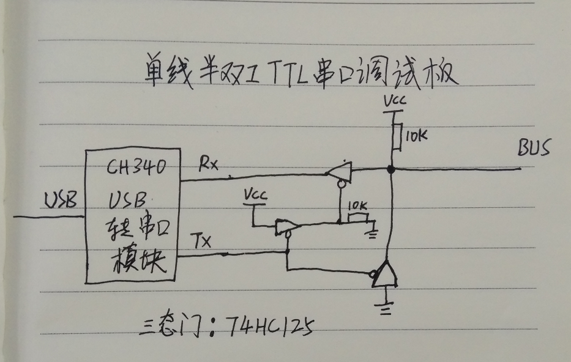

洞洞板焊接的成品：   
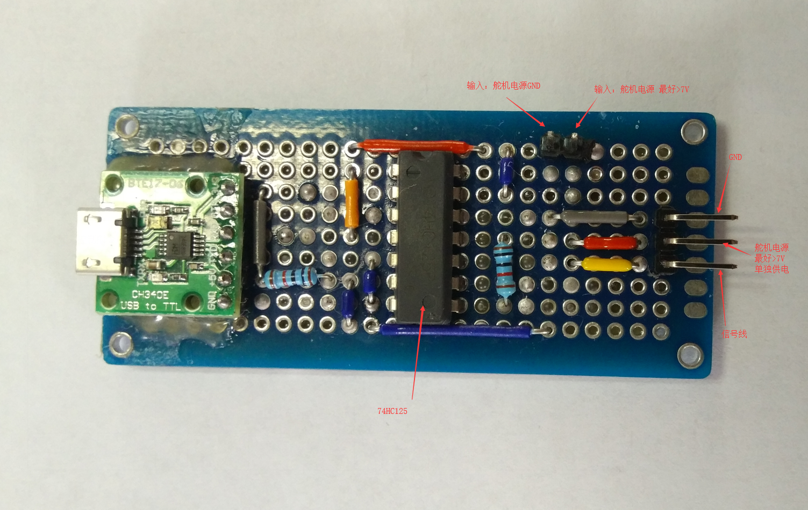

这块板能完全满足上文的要求，工作原理这里就不展开说了，大家感兴趣自行分析。   
性能： 做了两块通信板，连接在一起测试通信速度， 波特率1Mbps以下毫无压力！    

如果想参照我提供的电路图自制通信板，需要注意几个细节：     
- 舵机的电源一定要独立供电，不要使用通信板的电源（上图中我的通信板的舵机电源正极排针仅仅是为了接线方便，它和通信板其他元件没任何连接）   
- 通信板电源和舵机电源一定要共地    
- 如果想用arduino来驱动舵机，通信板上 VCC/GND/TX/RX 要用排针引出，方便接线，有条件的干脆做两块板，一块专门给上位机用，一块去掉CH340模块直接给arduino用        

#### 9. arduino驱动舵机 

项目中的 arduino_bus_servo_demo.ino 文件是arduino例程代码.      
arduino_bus_servo_demo.py是为了在PC上方便测试舵机动作而额外写的一份测试代码,使用上文自制通信板控制舵机.    
两份demo的控制逻辑完全相同.       

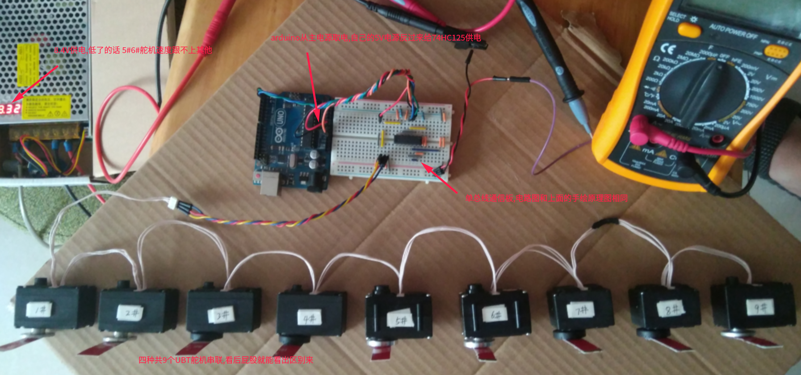

上面这张图是demo程序的连线图

此外,为了能直观感受下demo的效果,我还录了一个视频,已经上传到B站了,视频链接:    
https://www.bilibili.com/video/av51309465     
欢迎围观

#### 10. 某宝在售的4种某必选舵机的比较测试
先上一张图：

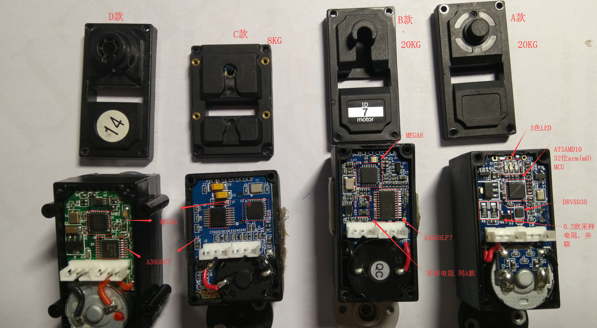

目前为止，我在TB上只收集到了以上4中型号的舵机，看舵机的后屁股盖儿就能看出区别来。为了便于后面的说明，我在图里给每种都命名了款型代号。    

A、C、D均是全铜齿轮组；    
B是钢制齿轮组；    
图上的A、B、C三款的扭力数据我是根据，PCB反面丝印以及堵转电流大小猜测的到的结果，个人认为准确度很高；    
图上还列出了各自的主控MCU型号以及电机驱动芯片的型号。    

(题外话：A4959xxx这个型号的驱动IC我在ALLEGRO官网上没找到，网上也没搜到相关资料，如果看到的朋友对此IC有了解，请指教一二，评论私信均可，先行表示感谢！)    

工作电流及堵转保护测试结果(测试条件: 舵机供电电压7.4V)：

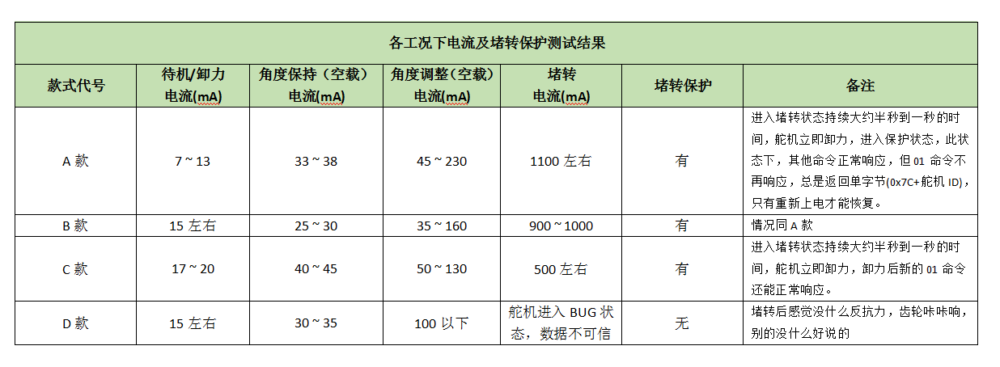

最后再说一下舵盘的问题：
A C两款舵轴是一样的，24T， 两者舵盘可通用，但TB上能买到的24T舵盘都不能用在上面，当前只能使用拆机件原装舵盘。      
B款舵盘是单独规格的，多少齿我没数，但舵轴直径粗略测量比A、C的小。      
D款舵盘比较常见，25T，996型号的标准舵机的舵盘就能使用。      